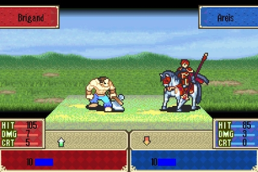
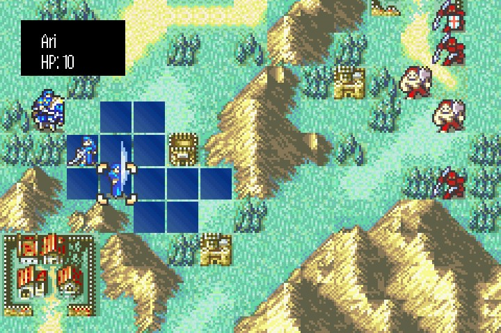

# FireEmblem7-java-version
  Java version of Fire Emblem 7 with custom maps and units. 
  Graphics are implemented with Java swing, and project was created on IntelliJ.
  Fire Emblem is turn-based strategy game with unique units with their own 
  weapons and classes. 
  All sprites were ripped from the original game.

## Screenshots
  Battle screenshot:
  
  
  
  Overworld screenshot:
  
  

## Downloads
  Download from the [Release Page](https://github.com/Fossilia/FireEmblem7-java-version/releases). 
  As of now, only Windows machines are directly supported but you can build the game yourself
  on Linux or Mac.
